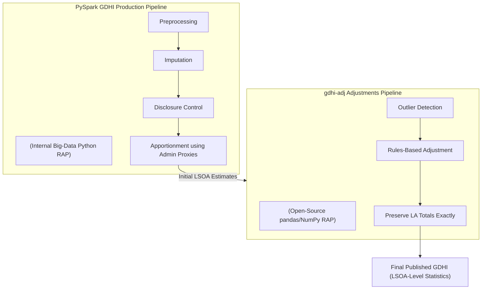

# GDHI Adjustments Pipeline (gdhi-adj)

[](https://github.com/psf/black)
[](https://flake8.pycqa.org/)
[](https://www.python.org/downloads/release/python-3120/)
[](https://github.com/google/styleguide/blob/gh-pages/pyguide.md)

## 🏠 Introduction to GDHI

[Gross Disposable Household Income (GDHI)](https://www.ons.gov.uk/economy/regionalaccounts/grossdisposablehouseholdincome)
represents the amount of money households have available for spending or saving after
accounting for income received and taxes or social contributions paid. It is widely
used to assess economic well-being, understand local living standards, and
monitor regional inequalities.

There is growing demand for more granular [subnational statistics](https://www.ons.gov.uk/aboutus/whatwedo/programmesandprojects/onscentres/centreforsubnationalanalysis)
to support evidence-based policymaking, including local planning, targeted investment, and
the UK's broader [Levelling Up agenda](https://www.gov.uk/government/publications/levelling-up-the-united-kingdom).
While the ONS publishes GDHI annually at the local authority (LA) level,
many users require neighbourhood-level insights.

To meet this need, the ONS produces experimental small-area GDHI by apportioning
LA totals to Lower Layer Super Output Areas (LSOAs). LSOAs are small,
neighbourhood-level geographies designed for statistical reporting, with an
[average population of around 1,500 residents or 650 households](https://www.gov.uk/government/statistics/english-indices-of-deprivation-2025/english-indices-of-deprivation-2025-statistical-release#:~:text=on%20average%201%2C500%20residents%20or%20650%20households).
This apportionment approach uses administrative, demographic, and housing-based proxy indicators and
is documented in the ONS article
[Disaggregating UK subnational gross disposable household income to lower levels of geography: 2002 to 2021](https://www.ons.gov.uk/economy/regionalaccounts/grossdisposablehouseholdincome/articles/disaggregatinguksubnationalgrossdisposablehouseholdincometolowerlevelsofgeography/2002to2021)

Because these proxy datasets come from operational administrative systems, they can
introduce artefacts or instability at very fine geographies. The `gdhi-adj`
pipeline provides the final quality-assurance step in the workflow; the pipeline ingests
these initial estimates and applies transparent, reproducible adjustments to correct
known statistical artefacts, refine distributions, and ensure local authority totals
are preserved exactly.

## ⚙️ Pipeline Overview

The main Gross Disposable Household Income (GDHI) statistical production is
handled by a core `PySpark` pipeline. This internal process manages **Preprocessing**,
**Imputation**, **Disclosure Control**, and **Apportionment** to derive initial
LSOA-level estimates from administrative, demographic, and housing-based datasets.

This `gdhi-adj` repository provides the **final, open-source quality assurance module**
for that process. Its purpose is to transform the initial, proxy-based estimates -- which
may contain statistical artifacts or implausible outliers -- into final, publishable data.
(See the section below *Why Are Adjustments Needed?* below for an explanation
of why these initial estimates require correction.)

It is a lightweight Python pipeline, built using `pandas` and `NumPy`, and developed
in line with the [Government Statistical Service's (GSS) Reproducible Analytical Pipeline (RAP) principles](https://analysisfunction.civilservice.gov.uk/support/reproducible-analytical-pipelines/) and [modern best practices](https://best-practice-and-impact.github.io/qa-of-code-guidance/intro.html#).

The `gdhi-adj` pipeline ingests the initial LSOA estimates and
applies a transparent, rules-based **constrained statistical editing** process.

This refinement operates on a core methodological principle: the
high-level **Local Authority (LA) total is treated as a fixed "anchor."**
To maintain **National Accounts integrity**, estimates must satisfy the
principle of **additivity and coherence**, meaning that all lower-level
geographic aggregates (LSOAs) must sum exactly to their parent LA total.
This is consistent with standard statistical approaches such as
**benchmarking** and **constrained estimation**, where trusted control
totals are preserved and only the within-area distribution is adjusted.
This creates a clear hierarchy of trust: the LA-level total is accepted as
statistically robust and fixed, while the *intra-LA distribution* (the
apportionment to LSOAs) is treated as more uncertain and therefore subject
to refinement.

Therefore, the pipeline's adjustments are a **constrained re-distribution**. When an
LSOA outlier is corrected (e.g., its value is reduced), that same amount is **not**
removed from the system. Instead, it is proportionally re-apportioned to all
other LSOAs *within that same LA*. This "zero-sum" approach ensures that the final,
refined LSOA estimates perfectly sum back to the original, unchanged LA totals.

The result is a reliable and statistically consistent set of GDHI statistics at
the LSOA level, ready for publication.

The diagram below shows where the `gdhi-adj` module sits within the wider GDHI
production workflow, from the initial `PySpark` pipeline through to the final
publishable LSOA dataset.



## ❓ Why Are Adjustments Needed?

As outlined in the ONS methodological article [Disaggregating UK subnational gross disposable household income to lower levels of geography: 2002 to 2021](https://www.ons.gov.uk/economy/regionalaccounts/grossdisposablehouseholdincome/articles/disaggregatinguksubnationalgrossdisposablehouseholdincometolowerlevelsofgeography/2002to2021),
the core pipeline matches each GDHI component with a proxy indicator selected for its
conceptual relevance, correlation strength, and geographic granularity.

For major components, this includes administrative data from
**HM Revenue and Customs (HMRC) Pay As You Earn (PAYE)** records and
the **Department for Work and Pensions (DWP) Customer Information System / Benefit Information Data Set (CIS-BIDS)**.
For others, demographic and housing-based indicators -- such as adult population counts and
dwelling stock -- are used to distribute LA-level totals into LSOA-level estimates.

However, while administrative data provides exceptional coverage and granularity,
it also introduces predictable challenges because it is collected for operational,
not statistical, purposes. Issues such as conceptual misalignment, administrative
volatility, partial coverage, and anomalous proxy distributions can lead to implausible
or unstable LSOA-level estimates.

These challenges are *well recognised within official statistics*: for example, the
ONS notes that “administrative data are generally not collected for the sole purpose of
producing statistics… [which] can lead to challenges when using them” in its report on [Exploring the quality of administrative data using qualitative methods](https://www.ons.gov.uk/methodology/methodologicalpublications/generalmethodology/onsworkingpaperseries/exploringthequalityofadministrativedatausingqualitativemethods),
and further documents a range of inherent error sources -- such as representation and
measurement errors -- in its guidance on [Cataloguing errors in administrative and alternative data sources](https://www.ons.gov.uk/methodology/methodologicalpublications/generalmethodology/onsworkingpaperseries/cataloguingerrorsinadministrativeandalternativedatasourceswhatwhenandhow).
These distortions are therefore inherent to using administrative data as proxies
rather than direct measures.

### The "Noisy-Shares" Problem: From Proxy Data to Flawed Estimates

This challenge stems from what we'll call the **"Noisy-Shares Problem"**. This concept
describes the potential for inaccuracy that arises because our LSOA-level estimate
is only as good as the proxy data used to create it. The calculated "share" for an
LSOA is only an *estimate* of the true, unobservable proportion of the LA's
income that genuinely originates in that LSOA.

This estimated share is inevitably a composite of two things:
1. **The True Economic Signal**
2. **Statistical Noise**

This "noise" can creep in from many sources; **here are just a few below**:
- **Measurement Errors:** Quirks in how administrative records are kept.
- **Sampling Errors:** When a survey, rather than a full census, is used to create
  a proxy indicator.
- **Random Anomalies (Idiosyncratic Events):** A few high-income individuals
  temporarily boosting one LSOA’s tax total for a single year.
- **Persistent Biases:** An LSOA hosting a corporate headquarters or many P.O. boxes
  might repeatedly receive an overestimated GDHI allocation because the proxy
  (e.g., self-employment business addresses) over-allocates income there.

In the initial GDHI model, the apportionment process is forced to treat this noisy
share as a perfect, error-free coefficient. It has no mechanism to distinguish the
signal from the noise. This means it can **"overfit to the noise"** producing volatile or
implausible LSOA estimates that look precise but are actually just statistical artifacts.

The risk is that sharp year-on-year fluctuations may not reflect a true change in
economic fortunes but rather an artifact of noise in one of the proxy indicators.

### Inherent Property: Spatial Smoothing

In addition to noisy-shares, the estimates also display an inherent statistical
property known as **spatial smoothing**. This occurs because the **apportionment process**
itself naturally averages out local extremes, leading to smaller measured differences
between neighbouring areas.

Crucially, **unlike the "noisy-shares" problem** -- which introduces statistical artifacts
that the `gdhi-adj` pipeline is designed to correct -- this smoothing is an unavoidable
consequence of the apportionment methodology and the limits of the available proxy data.

In reality, incomes can differ sharply even between adjacent neighbourhoods -- for example,
a high-income apartment complex next to a social housing estate. The true variation can
be substantial. However, when producing the LSOA-level GDHI estimates, the apportionment
model is constrained by its inputs.

A key driver of this smoothing is the **granularity of the proxy data**.
For instance, the **GDHI apportionment** for a component like rental income might use
"total number of dwellings" as its LSOA-level proxy. This proxy *cannot*
differentiate between a high-rent luxury apartment and a low-rent social
housing unit *within that same LSOA*.

The model must therefore apply a single, *average* share of the LA's total rental
income to that LSOA based on its dwelling count, effectively smoothing over these
sharp, real-world differences.

The practical implication is that the dataset still successfully identifies which areas
are relatively richer or poorer. However, it may slightly **understate the true scale of inequality**
between neighbouring places that differ sharply in reality. We do not adjust the estimates
to remove this smoothing -- it is simply a natural statistical behaviour of this
apportionment method that analysts should be aware of when interpreting the results.

### Addressing the "Raw Data" Misconception

This reality addresses a common misconception: that statistical production should
be a simple, linear flow of **Raw Data $\rightarrow$ Processing $\rightarrow$ Publication**.

This view is incorrect. Official statistics are not just raw data; they are
a **curated product**. The production pipeline for any National Statistical Institute (NSI)
is an iterative process of validation, imputation, and correction designed to ensure the
final data is fit for purpose. Raw administrative data is notoriously "dirty," containing
the exact "noisy-share" errors described above.

This highlights a key distinction: **Statistical Integrity vs. Statistical Literalism**.

- A **literal-minded** approach would publish the raw, proxy-based outputs 'as-is,' even
  when they are known to contain these noisy-share artifacts.
- **Statistical integrity**, however, demands that producers use their expertise to
  correct for known biases and errors. The goal is to ensure the final data is the
  **best possible statistical estimate** of the underlying economic reality,
  given all available information.

Publishing known artifacts without correction would fail this test of integrity,
as it would present a flawed figure as a precise fact. This adjustment process is
therefore an essential act of **bias reduction**, moving the estimate *away* from
the known administrative bias and *closer* to the economic truth. This provides the
reliable neighbourhood-level insight that local authorities, policymakers, researchers,
and the like need to understand the true economic picture of their areas.

### An Essential Part of Statistical Best Practice

This formal quality control discipline is known as **Statistical Data Editing (SDE)**.
International guidance from bodies such as the UNECE and Eurostat, including the
[UNECE Statistical Data Editing Handbook](https://unece.org/DAM/stats/publications/editing/SDE3.pdf)
and [Eurostat’s Quality Assurance Framework](https://ec.europa.eu/eurostat/documents/3859598/13925930/KS-GQ-21-021-EN-N.pdf),
emphasises that statistical production is a multi-stage process involving cleaning,
validation, editing, and imputation.

In this context, a final, rules-based correction step is not merely desirable -- it is
an **essential and widely accepted component** of producing reliable small-area
statistics, particularly when administrative data is used as a proxy input.

## 🔍 Our Approach to Transparency and Reproducibility

The core GDHI Pipeline is implemented using `PySpark`, enabling it to efficiently
process, integrate, and transform very large administrative datasets.

Although this `PySpark` pipeline is currently closed-source, this is primarily due to
infrastructure and governance constraints. Specifically, it contains
**bespoke Statistical Disclosure Control (SDC) methods** designed to protect sensitive
administrative microdata from partners like **HMRC and DWP**. Despite being internal,
it is still a Python-based RAP and follows the same principles of reproducibility,
modularity, version control, and automated data processing.

Our long-term aim is to make as much of this core `PySpark` pipeline open-source as
possible to further increase transparency and encourage methodological scrutiny.

In the meantime, the `gdhi-adj` repository provides a fully open component of the
workflow. It enables anyone -- analysts, researchers, or users -- to inspect exactly how
outliers are identified, how expert-led adjustments are systematised, and how the
fundamental constraint of preserving LA totals is enforced. By publishing this
critical adjustment stage as an open-source RAP, we strengthen transparency,
encourage methodological collaboration, and build public trust in the methodology,
helping ensure that the final published GDHI small-area estimates are as accurate,
stable, and meaningful as possible.

## 💾 Installation

### User Installation:

1. **Clone the repository:**
    - Create a folder locally where you want to store the code.
    - Go into the folder, right click the blank space and select Git Bash Here.
      - NOTE: you may need to select "Show more options" to see Git Bash.
    - In the terminal that pops up, paste in the following:
   ```sh
   git clone https://github.com/ONSdigital/gdhi_adj.git
   ```
2. **Setup python locally:**
    - Go to the following link and read through the wiki on how to install and get python setup in your local area:
      https://gitlab-app-l-01/ASAP/coding-getting-started-guide/-/wikis/python
    - This includes setting up the pip.ini file
    - Setting environment variables for pip and python
    - Ensure that the paths of the folders for conda and python are stored in your account environmental variables with conda first and python second.
    - They should be something like:
      - Conda: C:\ONSapps\My_Miniconda3\Scripts
      - Python: C:\ONSapps\My_Miniconda3

3. **For users: Install Spyder 6**
4. **Sync Subnational Statistics sharepoint to OneDrive:**
    - Go to the Subnational Staistics sharepoint, and open the regional accounts folder, then go into the GDHI sub folder, and open '2025_manual_adjustments' folder, then in the menu row above the file path, click sync, and then open to allow it to open and sync to OneDrive.
5. **Install the required packages:**
    - In the top level gdhi_adj folder where you can see the config folder, right click in blank space and clikc open in terminal
   ```sh
   pip install -r requirements.txt
   ```
6. **Open in Spyder and set project directory**
    - Ensure that the project is open with only the first gdhi_adj folder showing at the top level.

### 👨‍💻 Developer Installation:

1. **Clone the repository:**
   ```sh
   git clone https://github.com/ONSdigital/gdhi_adj.git
   ```
2. **Install Python v. 3.12:**
    - Either use the script "Python Current Test" from Windows Software Center
    - or Install Miniconda via the Software centre and create a new Conda environment, by opening the anaconda prompt and inputting:
      ```sh
      conda create --name gdhi_adj_312 python=3.12
      ```

3. **For developers: install VS Code**
4. **Sync Subnational Statistics sharepoint to OneDrive:**
    - Go to the Subnational Staistics sharepoint, and open the regional accounts folder, then go into the GDHI sub folder, and open '2025_manual_adjustments' folder, then in the menu row above the file path, click sync, and then open to allow it to open and sync to OneDrive.
5. **Activate the virtual environment:**
   ```sh
   conda init

   conda activate gdhi_adj_312
   ```
6. **Install the package and its dependencies in "editable" mode (so changes to the code are reflected immediately without reinstalling):**
   ```sh
   pip install -e .
   ```
7. **Install and run all pre-commits:**
   ```sh
   pre-commit install
   pre-commit run -a
   ```

## 🚀 Running

1. **Config settings `config/config.toml`:**
    - Check settings in config/config.toml to ensure pipeline runs as intended.
    - Provided you have been able to sync Subnational Staistics sharepoint to your OneDrive, set local_or_shared to "shared", if using local: local filepaths will have to be input manually.
    - Only need run either preprocessing or adjustment at any one time, as the output from preprocessing requires manual analysis before the input is created for the adjustment module. The true/false switches for these can be found in user_settings.
      ```
      preprocessing = true
      adjustment = false
      ```
    - Choose if you want to run both or either of the z-score and inter-quartile range (IQR) calculations.
      ```
      zscore_calculation = true
      iqr_calculation = true
      ```
    - Check that the z-score threshold and IQR quantiles and multiplier values under user_settings are the desired values.
      ```
      zscore_lower_threshold = -3.0
      zscore_upper_threshold = 3.0
      iqr_lower_quantile = 0.25
      iqr_upper_quantile = 0.75
      iqr_multiplier = 3.0
      ```
    - For preprocessing the Regional Accounts data, it needs to be filtered by transaction_name in the user_settings.
      ```
      transaction_name = "Compensation of employees"
      ```
    - Check the years for filtering data (this is used in both preprocessing and adjustment)
      ```
      start_year = 2010
      end_year = 2023
      ```
    - Check the component filters for the constrained data, match the respective components of the unconstrained data.
      ```
      sas_code_filter = "G866BTR"
      cord_code_filter = "D75"
      credit_debit_filter = "D"
      ```
    - If you want to export the final output from the module you are running, set output_data in user_settings to true.
      ```
      output_data = true
      ```
    - File schema paths are stored under pipeling_settings no need to change these unless any new files or schemas are added.
    - File paths are stored in preprocessing_shared_settings and adjustment_shared_settings, these either need to change to match the inputs desired, or file names need to match these
2. **Run pipeline from `main.py`**

## 📬 Contact

For questions, support, or feedback about `gdhi-adj`, please
email [RDSA.Support@ons.gov.uk](mailto:RDSA.Support@ons.gov.uk).

## 🛡️ Licence

Unless stated otherwise, the codebase is released under the [MIT License][mit].
This covers both the codebase and any sample code in the documentation.

The documentation is [© Crown copyright][copyright] and available under the
terms of the [Open Government 3.0][ogl] licence.

[mit]: LICENSE
[copyright]: http://www.nationalarchives.gov.uk/information-management/re-using-public-sector-information/uk-government-licensing-framework/crown-copyright/
[ogl]: http://www.nationalarchives.gov.uk/doc/open-government-licence/version/3/
